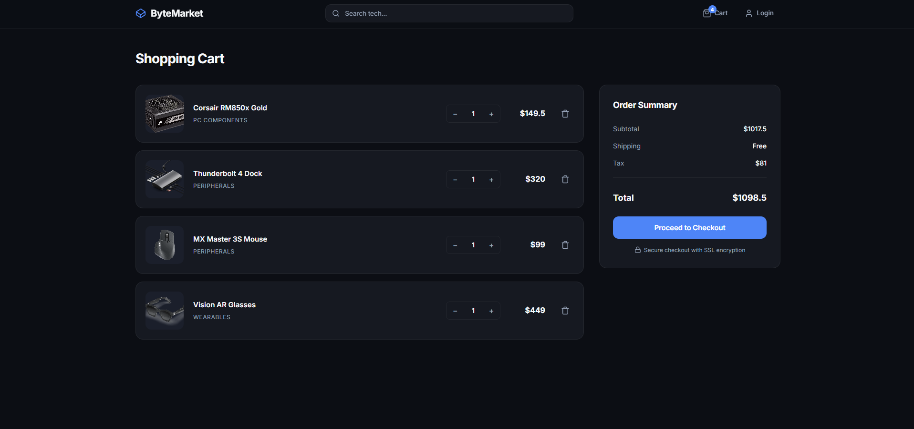

# ByteMarket | Full Stack Tech E-Commerce

A high-performance tech marketplace built with React (TypeScript) and Node.js (Express + MongoDB).
Users can browse high-end PC components, manage a shopping cart, and access a secure admin dashboard with a modern, "tech-first" UI.

---

## Screenshots

### Home Page

### Shopping Cart

---

## Features

- User registration (username, email, password)
- JWT login authentication & protected routes
- Dynamic product search and category filtering
- Real-time cart management (Add / Delete / Update)
- Automatic tax and shipping calculations
- Admin dashboard for inventory management
- Responsive layout for all devices

---

## Getting Started

### Prerequisites

- Node.js + npm
- MongoDB database (local or hosted)

---

### Backend Setup

# 1. Navigate to the server folder

cd server

# 2. Install dependencies

npm install

# 3. Create a .env file in server/

PORT=5000
MONGO_URI=your_mongodb_connection_string
JWT_SECRET=your_secret

# 4. Start Backend Server

npm run dev

---

### Frontend Setup

# 1. Navigate to the client folder

cd client

# 2. Install dependencies

npm install

# 3. Start the development server

npm run dev
